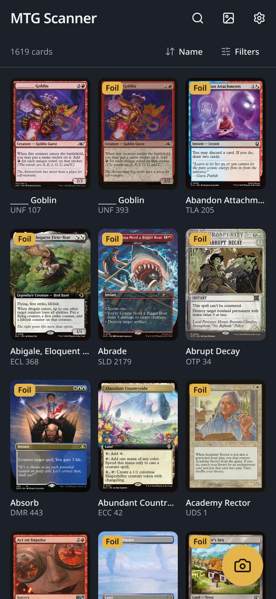
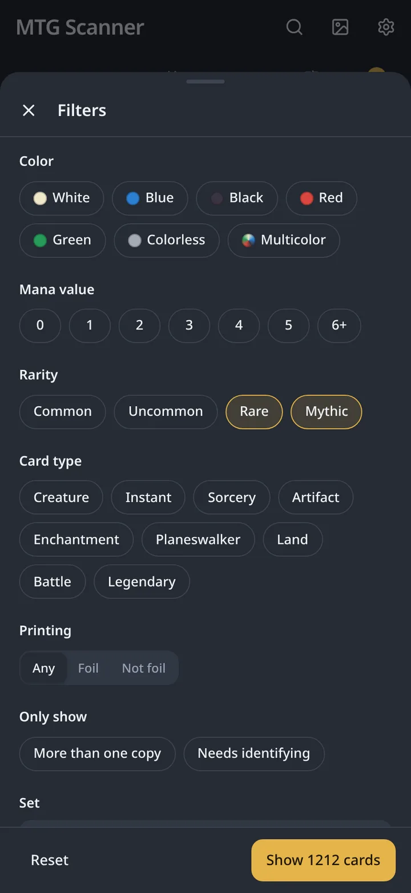
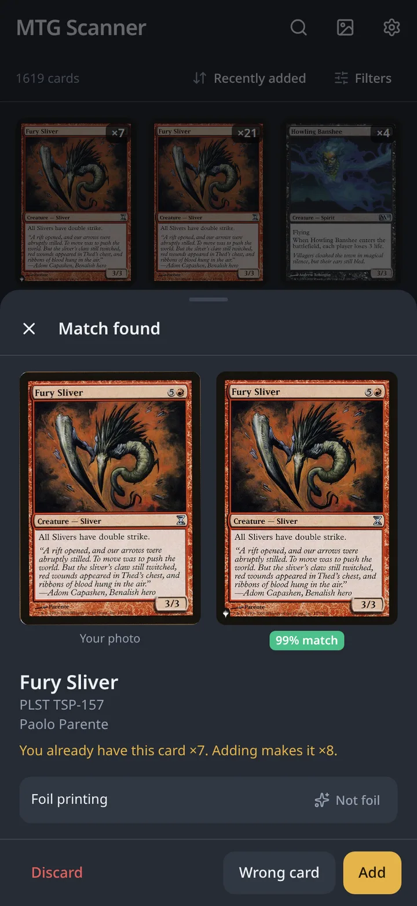
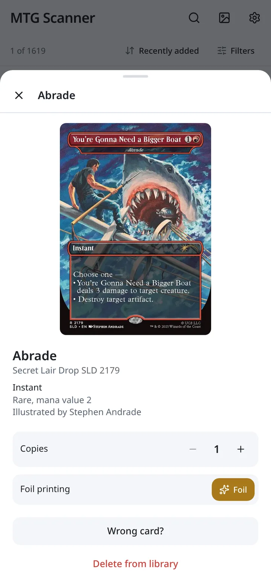
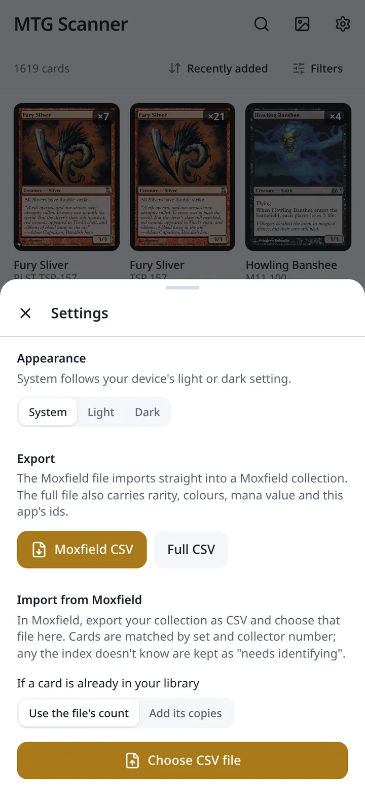

# MTG Scanner

> Note: This project is fully LLM genereated. I use it as my own experiment and anlysis on LLM feasibility. Use at your own risk.

Photograph a Magic: The Gathering card with your phone and get the exact
printing, then keep the collection in a library you can search, filter,
sort, import from Moxfield and export back. Everything runs on your own
machine: one Node process serves the app and does the identification, and
the phone only needs a browser on the same network.

- **Detection in the browser.** A YOLO oriented-box model (onnxruntime-web)
  finds the card in the photo, including a whole binder page, and a
  homography straightens each card before anything leaves the phone.
- **Identification on the server.** A frozen SigLIP2 encoder
  (onnxruntime-node, CPU) turns the straightened card into a vector and a
  brute-force cosine search over about 112,000 Scryfall printings picks the
  match. Roughly 99% top-1 on real phone photos, about 270 ms per card.
- **A library that stays consistent.** One row per printing and foil,
  enforced by the database itself with a unique index and an upsert: a
  second copy raises the count, a foil flip or a corrected printing folds
  into the card you already have, imports add to what is there. No merge
  buttons.
- **Filters and search.** Colour, mana value, rarity, type, printing, copies,
  set and artist; text search over names, set codes and set names, or a set
  code plus collector number, which works in any language.
- **Moxfield in and out.** Import a Moxfield collection CSV (matched by set
  and collector number), export the library in Moxfield's own layout.
- **Phone first.** Installable PWA, bottom sheets with swipe to close, works
  over plain http on a LAN, light and dark themes.

## Screenshots

<table>
  <tr>
    <td align="center"><br><sub>Library</sub></td>
    <td align="center"><br><sub>Filters</sub></td>
    <td align="center"><br><sub>Scan review</sub></td>
    <td align="center"><br><sub>Card detail</sub></td>
    <td align="center"><br><sub>Settings</sub></td>
  </tr>
</table>

## How it works

```
phone browser                                   server (Node 24)
──────────────                                  ────────────────
photo ─► YOLO OBB detector ─► rectify (488×680) ─► POST /api/identify
         onnxruntime-web        pure-TS homography     sharp resize 384×384
                                                       SigLIP2 → 768-d vector
                                                       cosine search, FAISS IndexFlatIP
                                                  ◄─ confidence + 5 candidates
review: confirm / correct / foil ──────────────► POST /api/cards (+ photo)
                                                       fold into owned printing, SQLite
```

Nothing is written until the user confirms a scan. The encoder is used
as published, never trained; the "knowledge" of cards is the index, one
reference vector per printing, so a new set only needs its images encoded
and appended. The only trained model is the detector, trained on synthetic
composites. `docs/overview.md` tells the full story and why each choice
was made.

## Repository layout

```
app/            The application: a pnpm workspace, one install, one lockfile, one node_modules
  web/          Browser source (SolidJS, Vite, Tailwind v4) → compiled into app/dist
  server/       Hono API + static file server (TypeScript run natively by Node, no build step)
    src/sql/    Every SQL statement, one per file, loaded at startup
  shared/       API types imported by both sides
  scripts/      Headless-Chromium screenshot tool used for UI review
training/       Python: Scryfall database, embedding index, detector training, ONNX exports
docs/           Design history, experiments and decisions, by phase
skills/         Step-by-step procedures (docs, UI verification, index refresh) for people and agents
AGENTS.md       Working instructions for anyone, human or model, changing this repository
data/           Default data directory: index, models, library, photos (gitignored)
bundle/         Output of make bundle (gitignored)
Dockerfile      Single-process container (node:24-slim, 315 MB), with docker-compose.yml
Makefile        Every workflow below, from the repository root
```

At runtime there is one process. It answers `/api/*`, serves scan photos
and the browser-side models, and serves the compiled frontend from
`app/dist`. `web/` and `server/` are separate folders only because one runs
in the phone's browser and the other in Node.

## Requirements

| Component | Needs |
|-----------|-------|
| Server and frontend build | Node 24 or newer, pnpm 11 (`corepack enable` installs it from `packageManager`) |
| Container route | Docker with BuildKit, or Docker Compose |
| Training pipeline (optional) | Python 3.11 in a conda environment with `faiss-gpu` from conda and `training/requirements.txt`; an NVIDIA GPU makes index builds take minutes instead of hours |
| Phone | Any modern browser. iPhone Safari and Android Chrome are the tested targets |

The server runs entirely on CPU and needs about 1.1 GB of memory, most of
it the index and the encoder. It does not need a GPU.

## Quick start

### 1. Provision the data directory

All persistent state lives in one directory: `data/` in the repository by
default (it is gitignored; override with `DATA_DIR`). Four files must be
there before the server will start; the server creates the rest.

```
DATA_DIR/
  index/card_index.faiss          FAISS IndexFlatIP, 768-dim SigLIP2 vectors     required
  index/card_metadata.parquet     one row per vector: printing, set, colours...  required
  models/siglip2-base.onnx        the encoder, exported to ONNX                  required
  models/card-detector.onnx       the detector, exported to ONNX                 required
  cards.db                        SQLite library (WAL)                           created on first run
  scans/{card_id}.jpg             the photo kept for each scanned card            created as you scan
```

**With the data bundle** (the usual way): `mtg-scanner-data-<date>.tar.gz`
is a single gzip archive of all four files, about 540 MB. Download the
latest one from the [Releases page](../../releases) of this repository,
where each release carries the bundle built from the index and models the
code was verified with. Unpack it into the data directory:

```sh
make unbundle BUNDLE=~/Downloads/mtg-scanner-data-20260903.tar.gz
# into another directory:
make unbundle BUNDLE=~/Downloads/mtg-scanner-data-20260903.tar.gz DATA_DIR=/srv/mtg-scanner
```

That is all the setup the data needs; continue with step 2. To produce a
bundle from your own data directory, for another machine or after an
index refresh, run `make bundle`; it writes `bundle/mtg-scanner-data-<date>.tar.gz`.

**Without a bundle**, build the files yourself; see
[Building the index and models](#building-the-index-and-models). Either
way, check with:

```sh
make check-data                       # or: make check-data DATA_DIR=/path/to/dir
```

### 2. Run natively

```sh
make install     # pnpm install inside app/
make start       # builds the frontend, then serves app + API on http://localhost:3000
```

Open the address on your phone using the machine's LAN IP, for example
`http://192.168.1.20:3000`, and add it to the home screen if you want it
installed as an app. `make start` binds to all interfaces by default.

For development, `make dev` runs Vite with hot reload on port 5173 and the
API server on 3000 side by side; Vite proxies `/api`, `/scans` and
`/models` to the server.

### 3. Or run the container

```sh
make docker-build
make docker-run                       # mounts data/ at /data; http://localhost:3000
```

or with Compose:

```sh
make compose-up                       # docker compose up --build, from the root
make compose-down
```

The data directory is mounted at `/data`; the database and photos are
written into it, so it is the only thing to back up.

## Configuration

Environment variables read by the server (`app/server/src/config.ts`):

| Variable | Default | Meaning |
|----------|---------|---------|
| `DATA_DIR` | `data/` in the repository | Root of all persistent state |
| `PORT` | `3000` | Listening port |
| `HOST` | `0.0.0.0` | Bind address; use `127.0.0.1` to keep it local |
| `WEB_DIST` | `app/dist` | Built frontend to serve; set to empty for API-only mode |
| `SCAN_CONCURRENCY` | `2` | Concurrent encoder passes; each is CPU bound |
| `EMBED_THREADS` | min(cores, 8) | Intra-op threads for the ONNX session |

The server refuses to start, with a list of what is missing, if any
required file is absent, and it logs one line per API request.

## Using the app

- **Scan.** The camera button opens the scanner; the photo picker offers the
  camera on phones and accepts drag-and-drop on desktop. One card goes
  straight to review, a binder page becomes a batch. The review shows your
  photo beside the matched printing, tells you if you already own it, and
  lets you flip foil, pick another printing from the closest matches or a
  search, or discard. Nothing is stored until you tap **Add**.
- **Find.** The search box takes part of a name, a set code, part of a set
  name, or `set number` such as `neo 172`. Filters cover colour, mana value,
  rarity, type, foil, copies, cards that still need identifying, set and
  artist. Sort by recently added, name, set, newest set, mana value or
  rarity. The whole view lives in the URL, so it survives reloads.
- **Edit.** Tap a card for copies, foil, a different printing, or delete.
  Cards that could not be identified are kept with their photo and appear
  under the "Needs identifying" filter until you pick their printing.
- **Import and export.** In Settings: export the library as a Moxfield CSV
  that imports into Moxfield unchanged, or as the app's full CSV with
  rarity, colours, mana value and ids. Import a Moxfield collection export;
  cards are matched by set and collector number, and existing cards either
  take the file's count (re-importing is a no-op) or gain its copies.
- **Appearance.** Settings also holds System, Light or Dark.

Photos taken on iPhone are transcoded to JPEG by the picker, so HEIC is not
an issue. Over plain http the live camera API is unavailable, which is why
the scanner uses the photo picker; that is deliberate and works everywhere.

## Building the index and models

You only need this if you want an index newer than the bundle on the
[Releases page](../../releases), or to change the models. The training
pipeline lives in `training/` and runs in the `learning` conda
environment. Run every script with `python -s` so a user-level numpy cannot
shadow the environment's; faiss is built against numpy 1.x.

```sh
cd training
python -s scripts/build_scryfall_database.py   # Scryfall bulk export (gzipped JSONL), downloads new images
python -s scripts/build_embedding_index.py     # encodes images missing from the index, appends, refreshes metadata
python -s scripts/export_siglip2_onnx.py       # → data/models/siglip2-base.onnx
python -s scripts/export_yolo_onnx.py          # → data/models/card-detector.onnx
```

Then copy the index into the data directory and restart the server:

```sh
cp training/_data/embeddings/siglip2-base-p16-384/card_index.faiss \
   training/_data/embeddings/siglip2-base-p16-384/card_metadata.parquet \
   data/index/
```

The index build is incremental: it embeds only images that are not in
the index yet. A new set of a few thousand cards takes under a minute on a
GPU. A full rebuild is only needed when the encoder or its preprocessing
changes, and `make parity` (below) is the check that Node still produces
the same vectors Python did.

Training the detector from scratch is `generate_card_detection_data.py`
followed by `train_card_detector.py`; see `docs/phase2-card-detection.md`.

## Keeping it running

- **Health.** `GET /api/health` returns `{ ok, cards_indexed, library_size }`.
- **Backup.** The data directory is the whole state. `cards.db` (with its
  `-wal` and `-shm` files if present) and `scans/` are the irreplaceable
  parts; the index and models can be rebuilt.
- **Footprint.** About 1.1 GB resident, flat over time; roughly 270 ms per
  identification on a desktop CPU; startup under a second.
- **Updates.** Pull, `make install`, `make start`. Schema changes are
  applied to the database directly on start. A library written before the
  one-row-per-printing rule is folded once on the next start, logged, and
  then locked by the index; later starts do nothing.
- **New sets.** Run the two build scripts, copy the two index files,
  restart. The library keeps working with an older index; cards from a set
  it does not know can be added as unidentified and fixed later.

## API

Everything the browser uses is plain HTTP on the same origin; the types are
in `app/shared/api.ts`.

| Method | Path | Purpose |
|--------|------|---------|
| GET | `/api/health` | Liveness, index size, library size |
| GET | `/api/library` | Every card with its printing attributes attached |
| POST | `/api/identify` | Photo body → confidence and top-5 candidates; stores nothing |
| POST | `/api/cards?card_id=&scryfall_id=&foil=` | Photo body → add the confirmed card (folds into an owned printing) |
| GET / PUT / DELETE | `/api/cards/:id` | Read, partial update (count, foil, printing), delete |
| GET | `/api/search?q=` | Name, or set code + collector number, over the reference index |
| POST | `/api/import?mode=set\|add` | Moxfield CSV body |
| GET | `/api/export?format=full\|moxfield` | CSV download |
| GET | `/scans/:id.jpg`, `/models/*` | Scan photos, browser-side ONNX models |

Bodies are raw images or JSON, never base64. Errors are JSON
`{ error, status }`. Image uploads are capped at 12 MB, CSV at 8 MB.

## Development

```sh
make check      # typecheck + Biome lint/format + unit tests (server and web)
make test       # unit tests only, via node --test
make parity     # Node preprocessing vs the Python-built index (needs training images on disk)
make dev        # Vite + API server with reload
make bundle     # pack data/ into bundle/mtg-scanner-data-<date>.tar.gz
```

- TypeScript throughout, one `tsconfig.json`, one Biome config, tabs.
- The server has no build step: Node 24 runs the `.ts` files directly.
- All SQL lives in `app/server/src/sql/`, one statement per file with
  named parameters; the store only binds parameters and maps rows.
- Tests use the built-in `node --test`; the server tests run against an
  in-memory SQLite and a fake identifier, so they need no data directory.
- `pnpm screenshot` drives headless Chromium over the DevTools protocol for
  reviewing the UI at phone and desktop sizes, in both themes.
- `AGENTS.md` sets out the rules of working here (verify before claiming,
  keep the docs in step, rules belong in the database, no migration
  framework); `skills/` holds the procedures those rules point to.

## Deployment notes

The container is the intended production shape: one process, one volume,
port 3000. Put it behind whatever reverse proxy or VPN you already use;
there is no authentication in the app itself, so do not expose it to the
open internet as is. A cloud deployment is not designed yet; when it is,
the shape will be a managed container for the API and identification,
a managed Postgres for the library, object storage for photos and
artefacts, and a CDN for the frontend, with the current stores kept for
local development behind small interfaces.

## Troubleshooting

| Symptom | Cause and fix |
|---------|---------------|
| Server exits with "Missing required files" | Provision the four files listed above, or point `DATA_DIR` at the right place |
| `import faiss` fails with a numpy error | A numpy 2 under `~/.local` is shadowing the environment's; run the scripts with `python -s` |
| Scryfall download returns HTTP 400 | Scryfall requires a descriptive `User-Agent`; the pipeline sends one, so update if you are on an old checkout |
| Phone shows "No card found" | Fill the frame and keep the card flat; the detector wants the whole card visible |
| Scan lands on the wrong language or printing | Use "Wrong card" and type the set code and collector number from the card |
| A card from a brand-new set is not recognised | The index predates the set; refresh it and identify the card from its detail view |

## Documentation

| Document | Contents |
|----------|----------|
| `docs/overview.md` | Architecture, pipeline, key decisions, project structure |
| `docs/phase1-embedding-index.md` | Scryfall pipeline, encoder, FAISS index, refresh procedure |
| `docs/phase2-card-detection.md` | Synthetic data and detector training |
| `docs/phase3-hybrid-pipeline.md` | Detection + rectification + identification end to end |
| `docs/phase4-refinements.md` | Model comparisons, the failed fine-tuning, OCR removal |
| `docs/phase5-interface.md` | The app: design, API, experiments, verification |
| `AGENTS.md` | Working instructions for contributors, human or model |
| `skills/` | Procedures: `update-docs`, `verify-ui`, `refresh-index` |

## License

Copyright (C) 2026 zluo01

This program is free software: you can redistribute it and/or modify it
under the terms of the GNU General Public License as published by the Free
Software Foundation, either version 3 of the License, or (at your option)
any later version. It is distributed in the hope that it will be useful,
but without any warranty; see `LICENSE` for the full text.

Card data and images come from [Scryfall](https://scryfall.com) under its
API terms; Magic: The Gathering is a trademark of Wizards of the Coast.
Neither is covered by this license.
